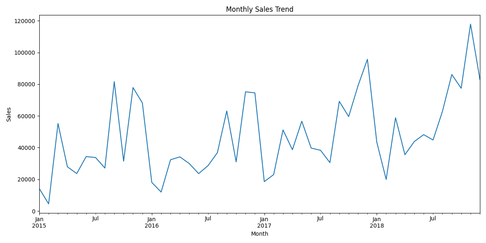
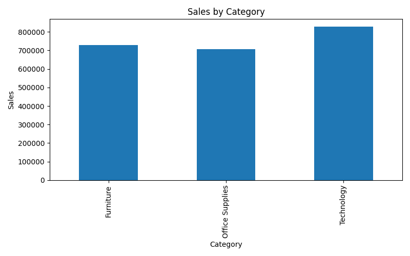
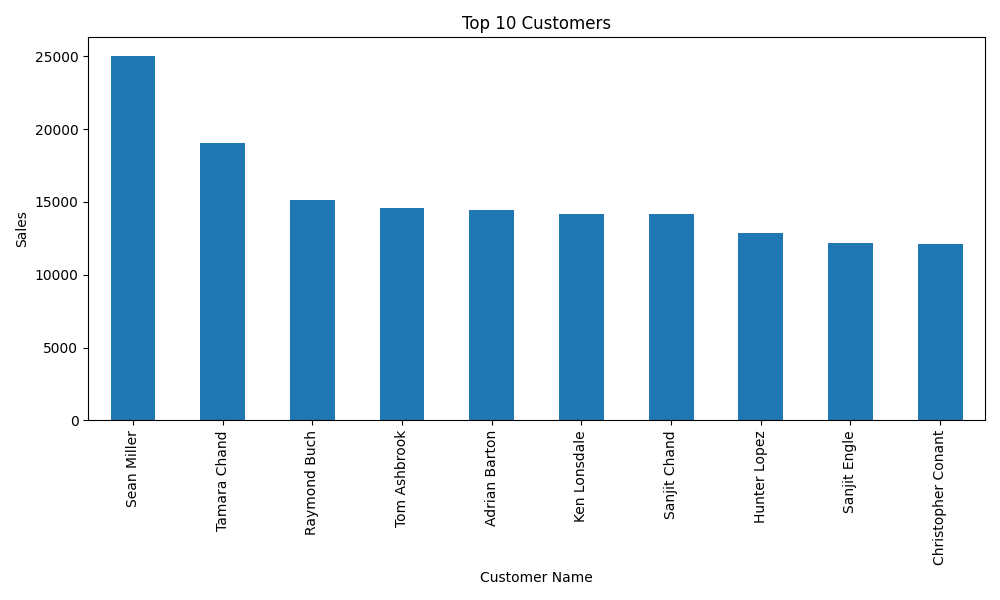
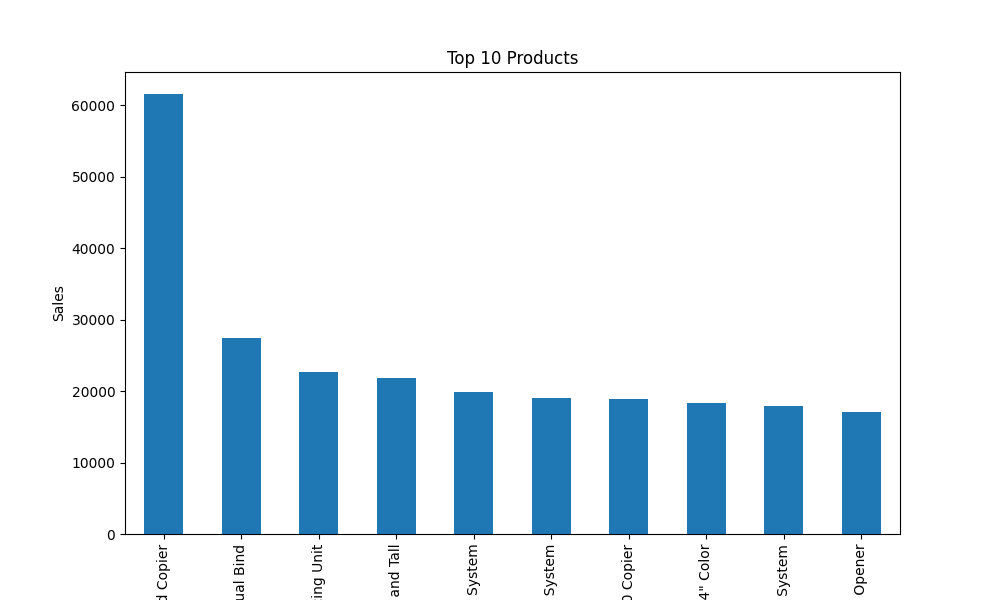

# Sales Data Analysis Project
## Project Overview
This project analyzes retail sales data using Python, Pandas, and Matplotlib to uncover business insights and sales trends.
The objective is to transform raw sales records into meaningful information that can help businesses make better decisions regarding inventory management, customer targeting, product strategy, and regional sales performance.
---
## Business Problem
Businesses collect thousands of sales records every day, but raw data alone does not provide useful insights.
This project helps answer important business questions such as:
- Which products generate the highest revenue?
- Which regions perform best?
- Who are the most valuable customers?
- Which product categories contribute the most sales?
- How do sales change over time?
---
## Dataset
The dataset contains retail sales transactions with information such as:
- Order Date
- Customer Name
- Region
- Category
- Sub-Category
- Product Name
- Sales
Each row represents a customer purchase transaction.
---
## Technologies Used
- Python
- Pandas
- Matplotlib
- CSV Dataset
- Git & GitHub
---
## Skills Demonstrated
### Data Cleaning
- Loading CSV datasets
- Handling missing values
- Understanding dataset structure
### Exploratory Data Analysis (EDA)
- Data inspection
- Sales trend analysis
- Customer analysis
### Data Visualization
- Bar Charts
- Trend Analysis
- Comparative Visualizations
### Business Analytics
- Revenue analysis
- Customer behavior analysis
- Product performance analysis
- Regional sales analysis
---
## Project Objectives
The project focuses on:
- Calculating total sales
- Analyzing sales by region
- Analyzing sales by category
- Identifying top-selling products
- Identifying top customers
- Visualizing monthly sales trends
- Generating business insights
---
## Project Structure
Sales-Analysis/
├── train.csv
├── sales_analysis.py
├── requirements.txt
├── README.md
└── charts/
---
## How to Run
### Install Dependencies
```bash
pip install -r requirements.txt
```
### Run the Project
```bash
py -3.13 sales_analysis.py
```
---
## Analysis Performed
### 1. Sales by Region
Analyzed total revenue generated across different regions to identify high-performing markets.
### 2. Sales by Category
Compared product categories to determine which category contributes the most sales.
### 3. Top Products
Identified products generating the highest revenue.
### 4. Top Customers
Analyzed customer spending behavior and identified valuable customers.
### 5. Monthly Sales Trend
Examined how sales change over time and identified trends and seasonal patterns.
---
## Key Insights
- Certain regions contribute significantly more revenue than others.
- A small number of products generate a large percentage of total sales.
- Top customers contribute a substantial share of total revenue.
- Sales performance varies across product categories.
- Monthly trends reveal fluctuations in customer demand.
---
## Business Recommendations
Based on the analysis:
- Increase inventory for top-selling products.
- Focus marketing efforts on high-performing regions.
- Develop customer retention strategies for valuable customers.
- Promote profitable product categories.
- Use monthly sales trends for demand forecasting and inventory planning.
---
## Results & Visualizations
### Monthly Sales Trend

### Sales by Category

### Top Customers

### Top Products

---
## Future Improvements
Possible enhancements include:
- Interactive dashboards using Power BI or Tableau
- SQL-based analysis
- Sales forecasting using Machine Learning
- Customer segmentation analysis
- Profitability analysis
---
## Author
### Madhuri Mudhiraj
Aspiring Data Analyst
Skills:
- Python
- Pandas
- SQL
- Data Visualization
- Data Analysis
- Git & GitHub
